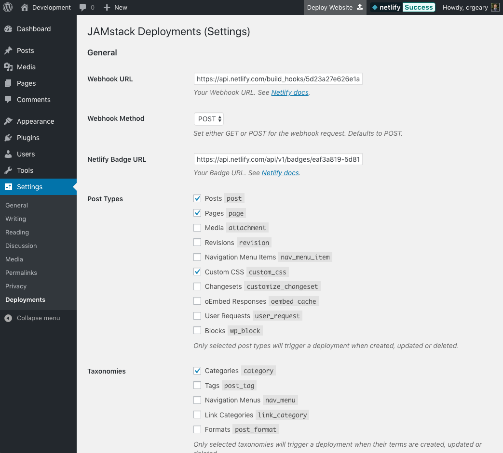

# JAMstack Deployments

A WordPress plugin for JAMstack deployments on Netlify (and other platforms).

## Description

This plugin provides a way to fire off a request to a webhook when a post, page or custom post type has been created, udpated or deleted. You're also able to fire off a request manually at the click of a button, or programmatically via a WordPress action.

## Screenshots



## Installing the Plugin

Clone the contents of this repository to your WordPress plugins folder and activate the plugin via the installed plugins page.

## Configuration

The plugin attempts to trigger builds when you update your content, and has settings that you can use to define what post types & taxonomies should be monitored.

You can access the plugin's settings in WordPress by accessing the 'Settings' panel on the left hand side of the dashboard and then clicking 'Deployments'.

From this screen you can configure the following:

- **Webhook URL** - The webhook URL that you have created to trigger a deployment. For more information on webhooks with Netlify [visit the Netlify documentation](https://www.netlify.com/docs/webhooks/).
- **Webhook Method** - This is the required method for the webhook request. The available options are `GET` or `POST`. By default the plugin will automatically select `POST`.
- **Badge Image URL** - An optional field to specify the `src` of a badge, for services that support badges.
- **Badge Link** - An optional field to specify the `href` of a badge, for services that support badges.
- **Post Types** - A list of selectable post types that will trigger a Netlify deployment when created, updated or deleted. Note that only selected post types will trigger a deployment.
- **Taxonomies** - A list of selectable taxonomies that will trigger a Netlify deployment when created, updated or deleted. Note that only selected taxonomies will trigger a deployment.

**If you need more control, there are actions & filters you can use to get the job done.**

### Post Types

You can choose which posts types should trigger builds from the plugin settings. However, you may require more control, or need to overwrite the settings, you can do so using the `jamstack_deployments_post_types` filter. By default, this filter contains an array of post types that we monitor. You can add or remove them as required.

For example, if you want to force the plugin to trigger builds for the `'post'` post type regardless of the settings, you can do so with the following code:

```php
add_filter('jamstack_deployments_post_types', function ($post_types, $post_id, $post) {
    if (!in_array($post->post_type, $post_types, true)) {
        $post_types[] = 'post';
    }
    return $post_types;
}, 10, 3);
```

### Taxonomies

Like post types, you can choose which taxonmies should trigger builds from the plugin settings. But there may be times you need more control. For this, you can use the `jamstack_deployments_taxonomies` filter. By defualt, this filter contains an array of taxonomies that we monitor.

For example, if you want to force the plugin to trigger builds for the `'post_tag'` taxonomy regardless of the settings, you can do so with the following code:

```php
add_filter('jamstack_deployments_taxonomies', function ($taxonomies, $term_id, $tax_id) {
    $tax = get_taxonomy($tax_id);
    if (!in_array($tax->name, $taxonomies, true)) {
        $taxonomies[] = 'post_tag';
    }
    return $taxonomies;
}, 10, 3);
```

### Post Statuses

You can use the `jamstack_deployments_post_statuses` filter to change which post statuses we monitor. The default is to monitor `'publish'`, `'private'` and `'trash'`.

Here is an example that adds `'review'` to the array of post statuses that we monitor & will trigger builds for.

```php
add_filter('jamstack_deployments_post_statuses', function ($statuses, $post_id, $post) {
    $statuses[] = 'review';
    return $statuses;
}, 10, 3);
```

## Custom Actions

The `jamstack_deployments_fire_webhook` action can be used to fire the webhook and trigger a build at a custom point that you specify. For example, if you want to fire the webhook when a user registers, then you can use:

```php
add_action('user_register', 'jamstack_deployments_fire_webhook');
```

## Running Code Before & After Webhooks

You can run code directly before or after you fire the webhook using the following actions:

* Before: `jamstack_deployments_before_fire_webhook`
* After: `jamstack_deployments_after_fire_webhook`

## Changing Webhook Request Arguments

You can modify the arguments sent to the `wp_remote_safe_*` functions using the `jamstack_deployments_webhook_request_args` filter.

## License
[GPL-3.0](LICENSE.md)
